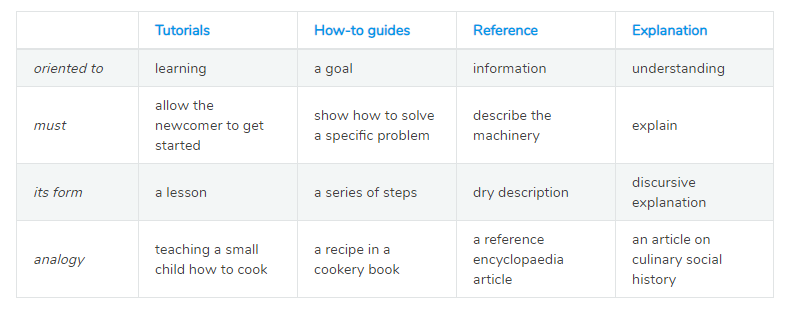

# 참고

- [Document System](https://www.notion.so/juunone/17b9cadd221e4d58921c7a5662f093a4?v=004925ec493948a1bc529e1e4e25515e)
- [lazygyu](https://lazygyu.net/blog/secrets_of_documentation)

# 서론

소프트웨어는 문서화도 잘되어 있어야 더욱 흥할 수 있다.

# 역할

네 가지의 역할 중 하나에 속해야 하며, 각각의 역할에 맞는 구조를 가져야 한다.

완전히 다른 접근 방법으로 작성되어야 한다.

- Tutorial
    - 학습하기 좋은 문서
    - 어린아이에게 요리를 가르쳐주는것
- How-to guide
    - 목표 지향
    - 요리의 조리법
- 해설 / Explanation
    - 이해위주
    - 요리의 역사에 대한 기사
- 기술 참조 / Technical reference
    - 정보 중심
    - 동작을 기술
    - 객관적이고 정확한 내용
    - 요리 백과사전

# 인지하고 있어야 할 내용

### 명징한 소재

글이 길어지면 여러 개의 글로 나누고 가치는 더 커진다.

기록하고 분리하는것도 좋은 방법.

일단 기록하자.

---

### 도입부

도입부를 정의로 시작하는 것은 괜찮은 방식이다.

---

### 제목의 변별력