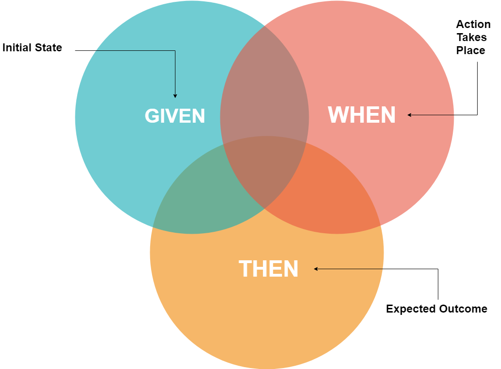

# 참고

- [cheuora brunch](https://brunch.co.kr/@cheuora/42)
- [https://yorr.tistory.com/26](https://yorr.tistory.com/26)
- [https://beomseok95.tistory.com/293](https://beomseok95.tistory.com/293)

# 학습 목표

- BDD (Behavior Driven Development) 알아보기

# BDD?

사실 Behavior Driven Development(BDD)는 유명한 다른 프로그래밍 방법론 TDD(Test-Driven Development) 와 비슷한 개념이지만 조금 다르다.

직역 하자면 행위 주도 개발이라고 부를 수 있는데, 이를 생각 해보자면

구체적인 예를 들고 프로그래밍 작동 방식에 대해 이해를 하는걸로 목표를 한다.

# BDD vs TDD

BDD와 TDD를 잠깐 비교해보자면

BDD는 시나리오 테스트를 권장하고, TDD는 함수 단위 테스트를 권장한다.

이는 TDD는 모든 작성된 함수에 대해서 테스트 케이스를 작성하지만,

BDD는 작성된 시나리오에 필요한 함수에 대해서만 테스트를 진행한다.

출처: [https://saucelabs.com/blog/a-two-minute-bdd-overview](https://saucelabs.com/blog/a-two-minute-bdd-overview)

위 그림과 같이 TDD는 더 작은 테스트 단위고 BDD는 `feature` 테스트 단위에 해당한다고 볼 수 있다.

# 그래서 BDD는 어떻게?

출처: [http://www.testmanagement.com/solutions/bdd-with-testcomplete-and-hiptest/](http://www.testmanagement.com/solutions/bdd-with-testcomplete-and-hiptest/)

BDD의 특징으로는 Developer Area, Business Area 모두 시나리오에 대한 이해를 할 수 있어야 한다.

반대로 개발자가 아닌 사람도 시나리오를 짤 수 있어야한다.

각 시나리오는 `Given`, `When`, `Then` 구조를 가지고 있다.

- Feature : 테스트 할 기능
- Scenario : 테스트의 목적 (무엇을 테스트 할 것인가?)
- Given: 초기 세팅(데이터, UI 등)
- When: 어떠한 행동을 가할때, 테스트 케이스
- Then: 성공적으로 수행했을때의 기대한 결과값.

# 정리

- BDD의 목적은 시나리오에 대한 검증을 요구한다.
- 한 개의 `feature` 에 여러 개의 다양한 시나리오가 나올 수 있다.
- 개발자뿐 아니라 기획자도 시나리오에 대한 이해를 하고 작성할 수 있어야 한다.