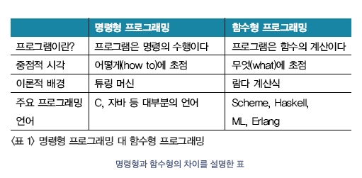

# 참고

- [evan moon 기술 블로그](https://evan-moon.github.io/2019/08/24/what-is-object-oriented-programming/)
- [https://blog.metafor.kr/141](https://blog.metafor.kr/141)
- [bccrwp](https://ko.bccrwp.org/compare/difference-between-oop-and-functional-programming-fc991b/)

# 학습 목표

- 함수형과 객체 지향의 프로그래밍 패러다임 차이에 대해 알아본다.

# 프로그래밍

명령형 프로그래밍

- 절차적 프로그래밍(PP): C
- 객체 지향 프로그래밍(OOP) : Java, Python

선언형 프로그래밍

- 함수형 프로그래밍:  SQL, HTML, Python

출처: [https://blog.metafor.kr/141](https://blog.metafor.kr/141)

# 객체 지향 feat.OOP

객체 지향 프로그래밍 또는 OOP는 객체 기반 프로그래밍을 의미한다.

데이터를 추상화시킨 객체를 클래스로 그룹화 하고 이를 실행한다. OOP의 각 개체는 일련의 작업을 담당한다.

객체 지향의 특징은 **상속**과 **캡슐화**, 그리고 **다형성 이다.**

예를 들어 구역으로 나눠 청소를 담당한다고 하면

바닥 청소: "철수 & 쓸고 닦기" = 같은 객체에 담기는 **바닥 청소 인스턴스**

화장실 청소 : "민수 & 물 뿌리고 닦기" = 같은 객체에 담기는 **화장실 청소 인스턴스**

객체를 먼저 만들고 함수를 만든다.

객체에 맞춰 메소드를 구현한다(상태를 바꾼다)

## 장점

- 코드의 양이 많아진다.
- 테스트가 어렵다.
- 코드 재사용성이 높다.

## 단점

- 처리속도가 상대적으로 느리다.
- 설계를 잘못하면 나중에 수정이 어렵다.

# 함수형 프로그래밍

선언형 프로그래밍인 함수형 프로그래밍은 문제 해결에 대한 접근 방식을 제공한다.

무엇(what)에 집중하며, 목표만 명시한다.

예를 들어, "6시가 되면 청소를 시작함" 이라는 선언형 프로그래밍이 있다면 반대로

위에서 설명한 명령형은 "6시가 되면 복도 끝에서 끝까지 쓰레받기와 빗자루를 들고 청소함" 으로 다르다.

함수를 먼저 만들고 함수에 맞게 데이터를 정제한다.(상태가 없다)

## 장점

- 데이터는 항상 immutable(불변성)이어야 한다.
- 함수는 순수 함수 이다.
    - 같은 입력에 항상 같은 결과값을 보여 준다. (side effect가 없어야 한다)
- 객체 지향보다 코드가 간결하고 가독성을 높인다.
- 비절차형으로 평가 시점이 중요하지 않고 테스트가 쉽다.
- 루프 보다는 재귀 호출을 사용한다.

## 단점

- 상태를 바꿀 수 없다.