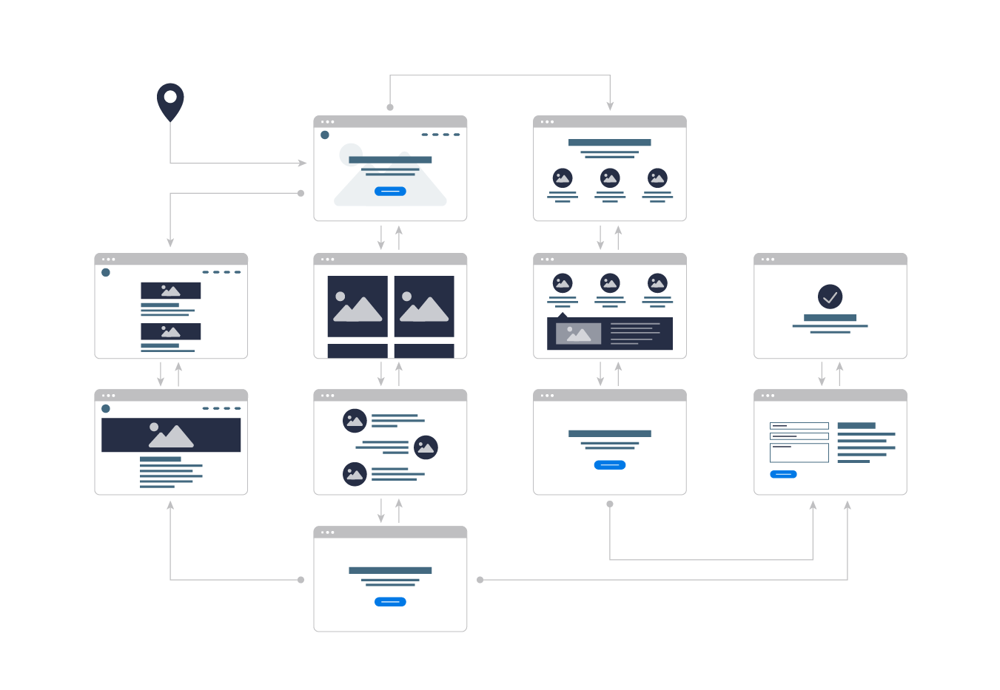
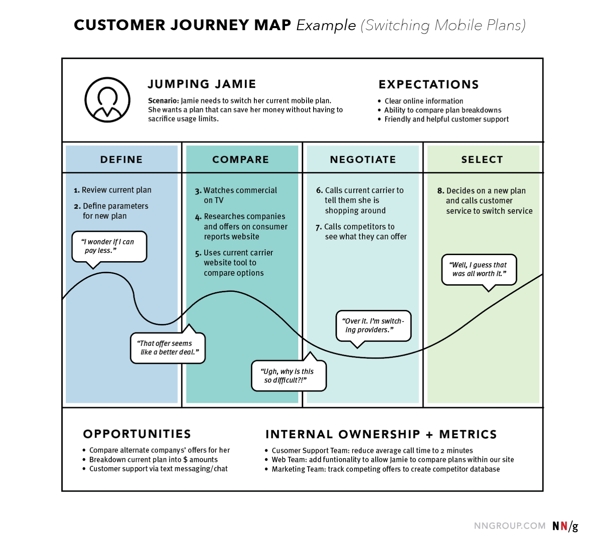

## 참고

- [https://uxmentor.me/user-journeys-beginners-guide/](https://uxmentor.me/user-journeys-beginners-guide/)
- [https://www.optimizely.com/optimization-glossary/user-journey-map/](https://www.optimizely.com/optimization-glossary/user-journey-map/)

## 학습 목표

- User Journey에 대한 이해와 그 기반을 따른 프로그래밍

## 사용자 여정이란?

사용자 여정은 상호작용 할 수 있는 프로세스이다.

사용자가 특정 목표까지 도달하기 위한 단계별 프로세스를 나타낸다.

출처: [https://www.optimizely.com/optimization-glossary/user-journey-map/](https://www.optimizely.com/optimization-glossary/user-journey-map/)

## 사용자 여정의 필요성

개인적인 견해로는 UX는 모두 데이터를 기반으로 설계되고 최적화가 되어야 한다.

사용자 관점에서 상호작용한 프로세스를 나타내는 유용한 데이터가 될 수 있다.

사용자의 의도를 이해하고 파악하는데 수월하며, 시스템과 상호 작용하며 기대하는 바를 파악할 수 있다.

또한 사용자 여정이라는 데이터를 통해 서비스를 만들고 있는 팀이 바라보고 있는 목표의 방향도 맞출 수 있다.

## 그래서 어떻게 해?

사용자의 문제를 알고 달성할 과제 2~3가지를 정해서 목표를 결정합니다.

사용자가 문제를 해결할 수 있는 가장 합리적인 방법을 생각한다.

e.g.

- 배달 앱 진입
- 좋아하는 메뉴 선택
- 메뉴의 구성과 사이드 디쉬를 선택
- 주문하기

사용자가 하려는 행동과 같은 세부 정보를 포함 할 수 있습니다.

각 기본 페르소나에 대한 맵을 만들어야 합니다.

1. 페르소나 선택 : 행동하려는 미션을 포함한다.
2. 터치 포인트 매핑 : 이동하는 경로의 타임라인 생성.
3. 설명: 사용자의 행동에 대한 생각 혹은 동기 등을 작성한다.
4. 시각화 생성: 시각적 표현을 통해 활용한다.

출처: [https://uxmentor.me/user-journeys-beginners-guide/](https://uxmentor.me/user-journeys-beginners-guide/)
