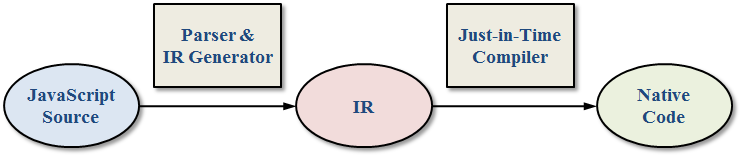
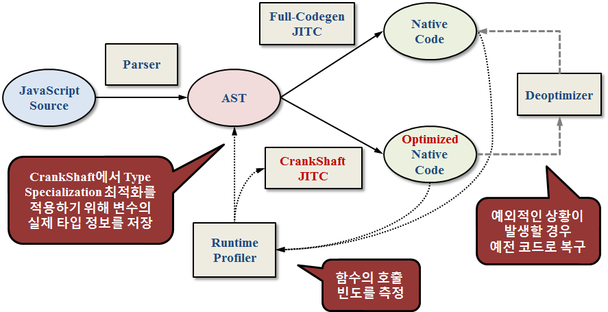

# 참고

- [TOAST 기술 블로그](https://meetup.toast.com/posts/77)

# 서론

TypeScript 컴파일러가 파싱 해서 추상 문법 트리(abstract syntax tree, AST)라는 자료 구조로 변환하는 내용을 보고(~~야크 털 깎기~~) JavaScript 엔진이 컴파일하는 JITC 방법에 대해 정리해 보고자 한다.

[야크 털 깎기(Yak Shaving)](https://www.notion.so/Yak-Shaving-628846ea37a349ac82cf1a9a73fabed6)

# JITC

JITC(just-in-time compilation)는 동적 번역이 라고도 불린다.

실행하는 시점에 바이트 코드를 네이티브 코드(기계어)로 변환한다.

컴파일의 종류로는 크게 3가지가 있다.

- JITC
- interpreter (JavaScript, HTML, Python) 스크립트 언어
- Static compiler[정적 컴파일] (Java, C, C++) 자료형 언어

JavaScript 엔진(Safari, Chrome, FireFox 등)은 모두 JITC 방식을 사용한다.



JITC 실행 방식

JavaScript는 처음에 소스를 파싱하고 IR(intermediate representation)인 중간 단계 bytecode로 변환됩니다.

이때 interpreter는 bytecode를 **하나씩 읽어 가며 실행**하고, JITC는 **`bytecode를 가지고 컴파일하고 실행`**한다.

성능 상으로 굳이 따지자면

Static compiler > JITC > interpreter 순으로 성능이 나뉜다.

JITC는 컴파일이 수행하며 발생하므로 Static compiler 같이 최적화 알고리즘을 적용하여 컴파일하는 것보다 성능이 더 낮다.

# 장점

JITC 의 장점으로는

- 실행 직전에 Native code로 컴파일.
- 정적 컴파일 만큼은 아니지만 최소한의 최적화는 적용된다는 점.

# JavaScript is Dynamic programming language

JavaScript는 **`동적언어` 이다.**

이 의미는 변수를 실행 시점에 알 수 있고, 언제든지 타입이 변할 수 있다는 것이다.

```jsx
'a' + 1 = 'a1'
'a' - 1 = NaN
'3' * '3' = 9
```

위 와 같이 JavaScript는 제멋대로 타입을 변경할 수 있기 때문에..

그렇다면 그 최소한의 최적화 기법도 별 소용이 없지 않은가? 라는 생각이 든다.

결국 JavaScript 는 `JITC = interpreter` 두 성능 차이가 미묘 하다는 것이다.

# 그래서 결론은?

AJITC (**Adaptive JIT Compilation)** 

> 그래서 최근 JavaScript 엔진들은 대부분 **adaptive compilation** 방식을 택하고 있습니다. Adaptive compilation이란, 모든 코드를 일괄적으로 같은 수준의 최적화를 적용하는 것이 아니라, 반복 수행되는 정도에 따라 유동적으로(adaptive) 서로 다른 최적화 수준을 적용하는 방식입니다.

인용 : TOAST 기술 블로그



JITC 실행 방식

모든 코드들은 기본적으로 interpreter 로 수행하며, 점차 반복 수행되는 부분이 발견되면 JITC 가 수행되 Native code로 변환된다.

- baseline-JITC : 최소한의 최적화
- Optimizing-JITC : 더 많은 최적화

Runtime Profiler가 중요한 역할을 하는데 변수의 타입 등의 정보를 저장 해두고 Optimizing-JITC에 활용한다.

이때 변수의 타입이 변하게 되면 다시 baseline-JITC 가 수행되는 것이다.

이 최적화는 다음과 같은 가정을 바탕에 두었다.

> 수행하는 동안 특정 변수의 타입이 변하지 않았다면 그 이후에도 그 변수는 타입이 변하지 않을 가능성이 매우 높을 것이다

인용 : TOAST 기술 블로그

# 결론

JavaScript를 사용할 때 변수 타입 변화는 최대한 지양하고,

위 내용을 알고서 타입에 대한 내용을 항상 기억하고 코딩 하자.

> **특히** **array가 중요한데, 하나의 array에는 하나의 type만 넣어주는 것이 최고입니다!**

인용 : TOAST 기술 블로그
