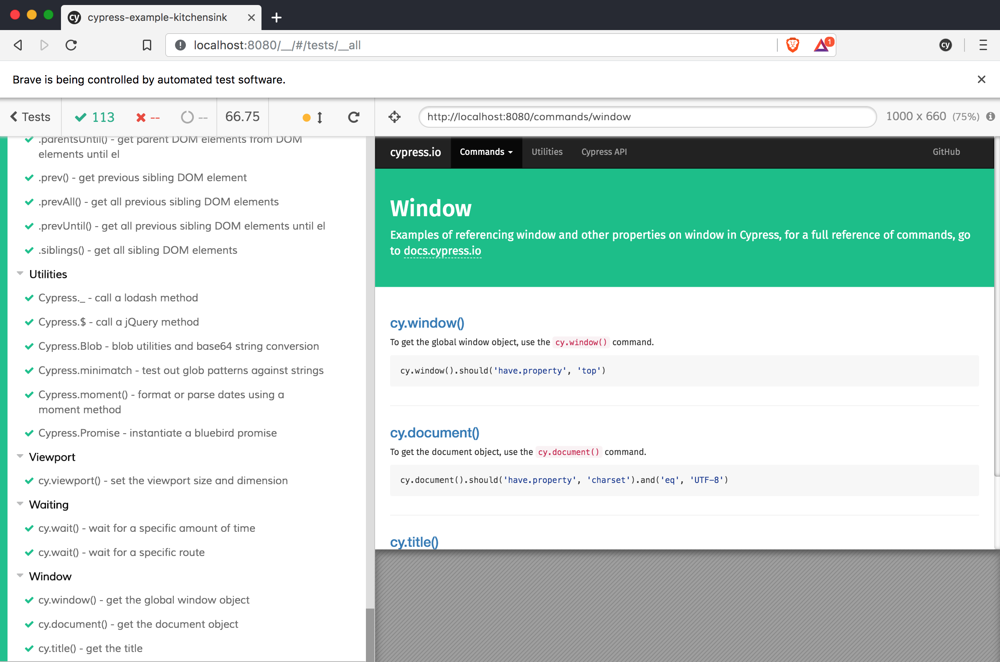
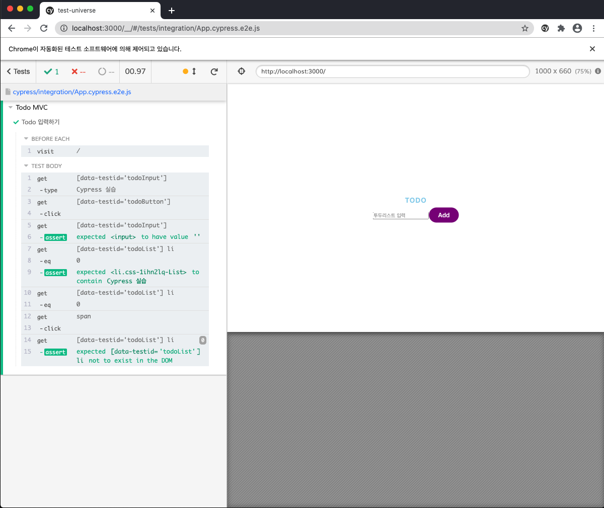

# 참고

- [https://github.com/juunone/test-universe](https://github.com/juunone/test-universe)
- [BDD-Behavior-Driven-Development](https://www.notion.so/BDD-Behavior-Driven-Development-0e6bdf1abcea41d881a6dc637d15da15)
- [Blackbox test](https://www.notion.so/f1976fb35a694ec6992535e7a12a053c) 

# 학습 목표

- [test-universe](https://github.com/juunone/test-universe) repository 테스트 코드 튜토리얼

# 들어가며

Front-End 에는 다양한 테스트 영역이 존재한다.

E2E, Unit, UI 테스트 등.. 테스트는 개인적으로 주관이 많이 개입되는 영역이라고 생각한다.

그래서 각자가 생각하는 테스트의 개념이 다르지만, 그 Goal 은 **소프트웨어 품질**로 동일하다.

이 글은 테스트를 다뤄 보는 목표 지향적이며, 세세한 함수들이나 명렁어는 다루지 않는다.

test-universe(이하 'TU' 라고 칭함) 는 간단한 TO-DO 앱을 통해 테스트 코드를 전반적으로 다뤄 본다.

# 사용 된 기술

- React with create-react-app
- [jest](https://jestjs.io/docs/en/snapshot-testing)
- [testing-library](https://testing-library.com/)
- [react-test-renderer](https://www.npmjs.com/package/react-test-renderer)
- [storybook](https://storybook.js.org/)
- [applitools](https://applitools.com/)
- [cypress](https://www.cypress.io/)

# [Cypress](https://docs.cypress.io/guides/getting-started/installing-cypress.html#Opening-Cypress)

cypress는 브라우저에서 일어나는 모든 것들을 눈으로 보며, 테스트 할 수 있게 도와주는 도구다.

- [cypress](https://docs.cypress.io/guides/getting-started/installing-cypress.html#Opening-Cypress), 
- [puppeteer](https://github.com/puppeteer/puppeteer) 

E2E 테스트 도구는 위 중 하나를 추천하고 싶다.
내가 cypress를 선택한점은 좀더 상호작용(interactive)이 원활하다.

## 장점

cypress는 Test GUI 를 제공한다.



출처: [https://docs.cypress.io/guides/guides/launching-browsers.html#Customize-available-browsers](https://docs.cypress.io/guides/guides/launching-browsers.html#Customize-available-browsers)

위 이미지처럼 단언문이 선언된곳에 대한 테스트 케이스 및 통과 여부도 확인이 가능하며,

오른쪽엔 실제 브라우저가 작동하는 preview까지 같이 보여준다.

테스트를 코드로만 보다가 화면을 보면 확실히 직관적이고 어떤 케이스에서 문제가 발생했는지 

빠르게 확인이 가능하다.

또한 [puppeteer](https://github.com/puppeteer/puppeteer) 와 다르게 jest를 쓰지않고 cypress 에서 제공하는 단언문을 사용해서 개발이 가능하다.

# Setup

```bash
yarn add cypress --dev
```

```json
"scripts": {
    "cypress:run": "cypress run",
    "cypress:open": "cypress open"
},
```

[cypress.json](https://docs.cypress.io/guides/guides/environment-variables.html#Option-2-cypress-env-json) 을 프로젝트 최상 위에 만들고, baseUrl, video, host, projectId 처럼

환경 변수를 설정 할 수 있다.

```json
//cypress.json
{
  "video": false,
  "baseUrl": "http://localhost:3000",
  "projectId": "XXXXXX" //cypress dashboard에서 테스트 결과를 볼 수 있다.
}
```

## Usage

cypress를 설치하면 프로젝트내 최상 위에  `cypress` 폴더가 생긴다.

내부에 .eslint.json을 만들고 생성해주자. test 코드의 cy 함수가 더 이상 린트에 걸리지 않는다.

```json
//cypress/.eslint.json
{
  "extends": [
    "plugin:cypress/recommended"
  ]
}
```

테스트코드 작성은 intergration 폴더 내부에 작성한다.

초기에 있는 파일은 예시로 모두 지우고 새로 만들어 준다.

jest의 단언문, testing-library 등 이 필요없이 cypress 내부 함수로 거의 모든 테스트 케이스 작성이 가능하다.

```json
//App.cypress.e2e.js
describe("Todo MVC", () => {
  beforeEach(() => {
    cy.visit("/"); //테스트 케이스를 실행할때마다 발생하는 beforeEach
  });

  it("Todo 입력하기", () => {
    // testid가 todoInput인 엘리먼트에 'Cypress 실습'을 입력
    cy.get("[data-testid='todoInput']").type("Cypress 실습");

    // testid가 todoButton인 엘리먼트 클릭
    cy.get("[data-testid='todoButton']").click();

    // testid가 todoInput인 엘리먼트의 value가 빈 문자열이어야 한다.
    cy.get("[data-testid='todoInput']").should("have.value", "");

    // testid가 todoList인 엘리먼트의 첫번째 자식 li는 'Cypress 실습' 이라는 텍스트를 포함한다.
    cy.get("[data-testid='todoList'] li")
      .eq(0)
      .should("contain", "Cypress 실습");

    //추가된 첫번째 투두 삭제 클릭
    cy.get("[data-testid='todoList'] li").eq(0).get("span").click();

    //투두리스트에 존재하는 투두가 없어야한다.
    cy.get("[data-testid='todoList'] li").should("not.exist");
  });
});
```

테스트 코드 작성후

`yarn cypress:run` 은 헤드리스로 실행되고

`yarn cypress:open` 은 GUI 와 함께 실행되는걸 볼 수 있다.



TU E2E 테스트 실행 결과

한가지 테스트 케이스에 총 3가지 단언이 되어있다.

1. 투두를 작성후 추가했을때 input 은 비어있는가
2. 리스트에서 첫번째 투두를 삭제했을때 삭제 되었는가
3. 투두가 존재하지 않을시 리스트는 보이지 않는가

위 와 같이 총 3가지로 진행됐으며 각 결과들은 초록색 라벨 뱃지가 붙어있는 결과물을 눌러 확인 가능하다.

왼쪽에는 작성한 코드 오른쪽은 화면이다 보니 직관적으로 내가 보고있는 코드 라인을 볼 수 있다.

개발자 도구를 열어 콘솔도 확인이 가능하다.