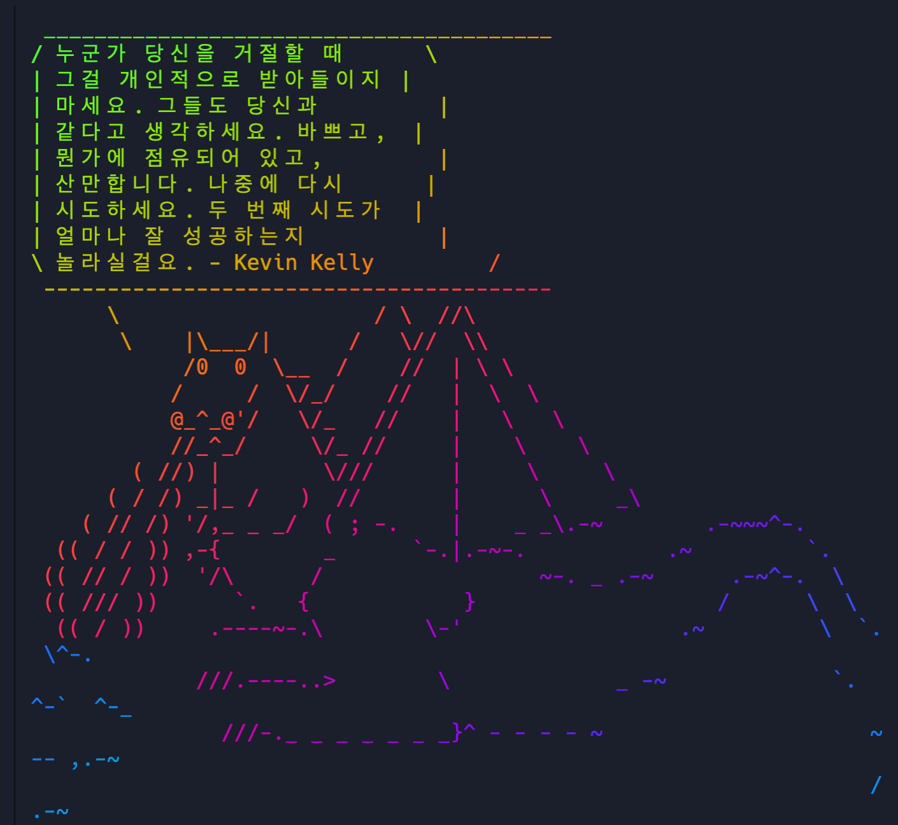

iTerm2 터미널 프로그램과 zsh 라는 쉘을 이용해 더 풍부한 기능과 편의성을 가진 터미널을 자기만의 스타일로
커스터마이징 하는 가이드에 대한 포스팅을 작성하고자 한다.

## [HomeBrew](https://brew.sh/) 설치


[HomeBrew](https://brew.sh/)
mac에서 사용되는 패키지들을 관리할수 있는 프로그램입니다.

## [iTerm2](https://www.iterm2.com/downloads.html)  설치


zsh 터미널을 사용하기위해
[iTerm2](https://www.iterm2.com/downloads.html) stable 버전을 설치해줍니다.

## zsh 설치


zsh은 bash와 다른 쉘입니다. 테마를 입힐 수 있고, 터미널 상태를 표시하는등 커스터마이징 할 수 있는 범위가 넓습니다.
아래 `brew` 커맨드로 설치합니다.

```sh
brew install zsh
```


zsh 플러그인입니다. 좀더 유틸성 있게 zsh를 활용할 수 있습니다.
아래 쉘커맨드로 설치합니다.

```sh
sh -c "$(curl -fsSL https://raw.github.com/robbyrussell/oh-my-zsh/master/tools/install.sh)"
```

## iterm 테마추가

[oceanic-iterm-theme](https://drive.google.com/file/d/1ZYNEBnN1WwQ6u4BxCZJmszpKD1qUkDfD/view?usp=sharing)를 내려받고, 파일내부에 스크립트를 실행해줍니다.
그 후 iterm `preferences > colors > color presets`에
`oceanic` 테마가 추가된걸 확인할 수 있습니다.

## powerline font 설치

[powerline fonts](https://github.com/powerline/fonts) 에 들어가서 해당 깃 repo clone 한뒤 쉘스크립트를
실행해주면 다양한 powerline font가 설치된다.
powerline font를 사용하는 이유는 터미널에서 폰트의 깨짐 방지를 위해 사용한다.

## Hack Nerd Font 설치

powerline 폰트 및 아이콘 설치를 해준다.

```sh
brew tap homebrew/cask-fonts
brew install font-hack-nerd-font --cask
```

## oh-my-zsh 플러그인 설치

- [autojump](https://github.com/wting/autojump)
- [autosuggestions](https://github.com/zsh-users/zsh-autosuggestions)
- [syntax highlighter](https://github.com/zsh-users/zsh-syntax-highlighting)

나는 현재 이 세가지를 사용중이다.

### autojump

autojump는 이전에 진입했던 디렉토리를 `j {디렉토리}`를 커맨드로
원하는 디렉토리로 한번에 점프할 수 있는 플러그인이다.

```sh
brew install autojump
```

### autosuggestions

history 를 저장해놨다가 명령어를 추천해주는 플러그인이다.
기억에 의존하면 쉽게 잊을수 있는데 해당 플러그인은 비슷한 철자를 가지면 제시를 해주므로서 사용하기 편하다. 또한 오른쪽 방향키를 누르면 자동완성도 가능하다.

```sh
cd ~/.oh-my-zsh/custom/plugins

git clone https://github.com/zsh-users/zsh-syntax-highlighting.git
```

### syntax highlighter

명령어가 유효하면 색상이 변경된다.

```sh
brew install zsh-autosuggestions
```

## oh-my-zsh theme 설치

현재 사용하는 `powerlevel9k` 테마이고, 이걸 이용해서 터미널을 더 풍부하게 커스터마이징할 수 있다.

```sh
git clone https://github.com/bhilburn/powerlevel9k.git ~/.oh-my-zsh/custom/themes/powerlevel9k
```

## install LSD (LSDeluxe)

파일트리나 현재 폴더에 대한 터미널을 좀더 명확하고 규격화되서 잘보여주는 라이브러리다.

[lsd github repository](https://github.com/Peltoche/lsd#installation)

```sh
brew install lsd
```

.zshrc 에 아래와 같이 `alias`를 추가해준다.

```
alias l='ls -l'
alias la='ls -a'
alias lla='ls -la'
alias lt='ls --tree'
```

## install fzf

대충 커맨드라인에 쓰면 삭제하고 찾고등을
쉽게 할수 있는 커맨드라인 퍼지파인더 라이브러리다.

[fzf github](https://github.com/junegunn/fzf)

```sh
brew install fzf
```

## install gotop

cpu 및 램 그리고 배터리 등 현재 컴퓨터에 대한 프로세싱 모니터링을 한눈에 볼 수 있다.

[gotop github repository](https://github.com/cjbassi/gotop)

```sh
brew tap cjbassi/gotop
brew install gotop
```

## install neofetch and lolcat

현재 사용중인 OS 및 컴퓨터 정보를 한눈에 이쁘게 확인할 수 있다.

[neofetch github repository](https://github.com/dylanaraps/neofetch)

```sh
brew install neofetch
```

[lolcat github repository](https://github.com/busyloop/lolcat)

```sh
brew install lolcat
```

아래와 같이 명령어를 실행해보자.

```sh
neofetch | lolcat
```

## install cowsay

키치하게 터미널에 동물 아스키코드로 표현가능한 라이브러리다.

```sh
brew install cowsay

$ cowsay Hello World
 _____________
< Hello World >
 -------------
        \   ^__^
         \  (oo)\_______
            (__)\       )\/\
                ||----w |
                ||     ||
```

## install fortune

터미널 메세지를 포춘쿠키에담듯이 이쁘게 출력해준다.  
`-f` 와 플래그사용하면 다른동물로 표현가능하며  
`cowsay -l` 은 표현가능한 동물을 보여준다.

```sh
brew install fortune

$ fortune | cowsay -f sheep
 _________________________________________
/ This night methinks is but the daylight \
| sick.                                   |
|                                         |
| -- William Shakespeare, "The Merchant   |
\ of Venice"                              /
 -----------------------------------------
  \
   \
       __     
      UooU\.'@@@@@@`.
      \__/(@@@@@@@@@@)
           (@@@@@@@@)
           `YY~~~~YY'
            ||    ||
```

## random fortune & random cowsay & lolcat

포춘 및 카우세이를 랜덤으로 만들 수 있다.
또한 포춘 문법만 맞추면 자신이 원하는 명언을 노출 시킬 수 있다.
먼저 [포춘 문법](https://linux.die.net/man/6/fortune)에 맞춰서 `.txt` 파일을 생성해주고
아래 명령을 실행하면 `.dat` 파일이 생성된걸 확인 할 수 있다.

```sh
strfile fortunes.txt
```

이제 생성된 파일을 매 터미널 세션 실행마다 보여주면 된다.
아래 fortunes.txt.dat 파일이 저장된 위치경로를 지정해주고, `cowsay -l`을 통해서 카우세이의 config 파일 위치를 지정해준다.
마지막으로 `lolcat` 을 통해서 화려한 색깔을 입혀주면 끝.

```sh
fortune ~/fortunes | cowsay -f $(ls /usr/local/Cellar/cowsay/3.04_1/share/cows | sort -R | head -1) | lolcat
```



## .zshrc 설정

zsh의 config 파일인 `.zshrc`를 설정하면서
터미널에 색상을 변경한다거나 플러그인을 추가한다거나
하는 기능들을 덧붙일 수 있다.
아래와 같이 간단하게 몇가지 설정할수 있고 이외에도 많은
설정들이 존재한다.

xterm number로 프롬포트 엘리먼트 색상도 변경가능하다.
[prompt color chart](https://jonasjacek.github.io/colors/)

```sh
code ~/.zshrc

POWERLEVEL9K_LEFT_PROMPT_ELEMENTS=(user virtualenv rbenv dir vcs) #터미널 왼쪽에 위치할 EL

POWERLEVEL9K_RIGHT_PROMPT_ELEMENTS=(status) #터미널 오른쪽에 위치할 EL

POWERLEVEL9K_DIR_HOME_BACKGROUND="039" #home EL의 백그라운드 컬러

POWERLEVEL9K_DIR_HOME_FOREGROUND="black" #home EL의 포그라운드 컬러
```
