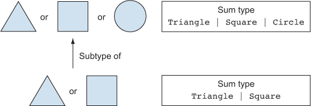

# 참고

- [O'REILLY](https://www.oreilly.com/library/view/programming-typescript/9781492037644/)
- [TypeScript Handbook](https://typescript-kr.github.io/pages/basic-types.html)
- [https://sojin.io/article/공변과-반공변/](https://sojin.io/article/%EA%B3%B5%EB%B3%80%EA%B3%BC-%EB%B0%98%EA%B3%B5%EB%B3%80/)
- [TypeScript Playground](https://www.typescriptlang.org/play)

# 학습 목표

- TypeScript 제어 흐름 기반 타입 확인, 타입 어서션, 프로토타입 확장하기 등의 패턴 알아보기

# 서브타입

세모, 네모, 동그라미 3개의 타입이 존재하고 세모와 네모는 그들의 '서브타입'이다.

세모, 네모, 동그라미가 필요한 곳에 서브타입을 사용할 수 있다.



출처: [https://livebook.manning.com/book/programming-with-types/chapter-7/](https://livebook.manning.com/book/programming-with-types/chapter-7/)

- 배열은 객체의 서브타입
- 튜플은 배열의 서브타입
- 모든것은 any의 서브타입
- never는 모든것의 서브타입
- Person을 상속받은 Student 클래스가 있다면 Student는 Person의 서브타입이다.

# 슈퍼타입

위 그림을 반대로 이해하면 그게 바로 슈퍼타입이다.

세모 네모 타입은 세모, 네모, 동그라미의 슈퍼타입이다.

# 가변성

TypeScript에서 모든 복합 타입의 멤버(객체, 클래스, 배열, 함수, 반환 타입)은 공변이며,

함수 매개변수 타입만 예외적으로 반공변이다.

가변성은 재네릭 타입에서 인자 `T` 가 가지는 성질이다.

A < : B는 A가 B의 서브타입 이라는 뜻이고 공변이다.

A > : B는 B가 A의 슈퍼타입 이라는 뜻이고 반공변이다.

## 종류

- 불변 (invariance) : 정확히 T를 원함
- 공변 (covariance) : <:T를 원함
- 반공변 (contravariance) : >:T를 원함
- 양변 (bivariance) : <:T 또는 >:T를 원함


출처: [https://www.stephanboyer.com/post/132/what-are-covariance-and-contravariance](https://www.stephanboyer.com/post/132/what-are-covariance-and-contravariance)

## 공변

```tsx
Array<T>
Array<Cat> <: Array<Animal>

Animal은 부모 타입
여기서 Cat은 Animal의 파생타입

Cat은 Animal에 속할수 있으며, Animal과 Cat은 부모타입-파생타입 관계를 유지하므로 T 는 공변이다.
일반적으로 제네릭 타입 T의 값에 대한 타입을 나타낼땐, T는 공변 타입이다.
T는 배열안의 각 원소 타입을 나타내고 이는 각 원소의 값으로 T는 공변이다.
```

```tsx
interface IAnimal<T> {
	value: T
}

let kindAnimal: IAnimal<string> = {
	value: 'Cat'
} 

type BirdorDog = 'Bird' | 'Dog'

let BirdorDogAnimal: IAnimal<BridorDog> = {
	value: 'Bird'
}

kindAnimal = BirdorDogAnimal //OK
BirdorDogAnimal = kindAnimal //TypeError
```

<T>는 타입이 들고 있는 값으로 사용되었고, 공변으로 추론된다.

`BirdorDog` 원소 값들은 모두 string의 서브타입으로 속할수 있다. 

*반공변의 경우는 string은 BirdorDog 원소값들의 슈퍼타입이다. 

string  = 부모타입, BirdorDog = 파생 타입이다.

공변이기 때문에 파생 타입을 가진 변수를 부모타입을 가진 변수에 대입을 하면 타입에러가 발생한다.

## 반공변

공변 타입과 정반대를 나타낸다.

제네릭 타입의 타입 인자 T가 함수의 매개변수 타입으로 사용될 때 T는 반공변이 된다. 

다음과 같은 제네릭 타입에서 타입 인자는 반공변이다. `input : T` 와 같이 매개변수의 타입으로 사용되었다.

TypeScript 에서 `T`가 함수 매개변수 타입으로 사용되는걸 확인하면 `T`를 자동으로 반공변 추론한다.

```tsx
Array<T>
Array<Cat> >: Array<Animal>

interface Aniaml<T> {
  locale: (input: T) => string;
}
```

# 타입 넓히기

TypeScript는 타입을 정밀하게 추론하기보다는 일반적으로 추론한다.

```tsx
// 값을 바꿀 수 있는 변수를 선언하면 그 변수의 타입이 리터럴 값에서 리터럴 값이 속한 기본타입으로 넓혀진다.
let a = 'x' //string
let b = 3 //number
var c = true //boolean

//값을 바꿀 수 없는 변수에서는 상황이 다르다.
const a = 'x' // 'x'
const b = 3 // 3
const c = true // true

//타입을 명시하면 타입이 넓어지지 않도록 막을 수 있다.
let a: 'x' = 'x' // 'x'
let b: 3 = 3 // 3

//변수 선언시 명시적으로 타입 어노테이션을 추가하면 자동확장이 되지 않는다.
const a = 'x' //'x'
let b = a //string

const c: 'x' = 'x' //'x'
let d = c //'x'

//null이나 undefined로 초기화된 변수는 any 타입으로 넓혀진다.
let a = null //any
a = 3 //any
a = 'b' //any

//const 를 사용하면 타입 넓히기가 중지되며 멤버들까지 자동으로 readonly 가 된다.
let c = {x: 3} as const //{readonly x: 3}

let d = [1, {x: 2}] // (number | {x: number})[]
let e = [1, {x: 2}] as const // readonly [1, {readonly x: 2}]
```

# 고급 객체 타입

## 키인 연산자

복잡한 중첩 타입이 있는 경우 키인 연사자를 사용해 한개의 타입만도 얻을 수 있다.

```tsx
type APIResonse = {
	user: {
		userId: string
		carList: {
			count: number
			cars: {
				model: string
				price: number
			}[]
		}
	}
}

type CarList = APIResponse['user']['carList'];

function renderCars(carList: CarList){
	//...
}

//모든 형태 (객체, 클래스 생성자, 클래스 인스턴스) 와 배열에 키인할 수 있다.
//다음과 같이 차 한종에 대한 타입도 얻을 수 있다.
type Car = CarList['cars'][number];
```

## keyof 연산자

`keyof` 를 활용하면 객체의 모든 키를 문자열 리터럴 타입 유니온으로 얻을 수 있다.

```tsx
type APIResonse = {
	user: {
		userId: string
		carList: {
			count: number
			cars: {
				model: string
				price: number
			}[]
		}
	}
}

type ResponseKeys = keyof APIResponse // 'user'
type UserKeys = keyof APIResponse['user'] // 'userId' | 'carList'
type CarListKeys = keyof APIResponse['user']['carList'] // 'count' | 'cars'
```

## 내장 매핑된 타입

- Record<Keys, Values>
    - Keys 타입의 키와 Values 타입의 값을 갖는 객체
- Partial<Object>
    - Object의 모든 필드를 선택형으로 표시
- Requires<Object>
    - Object의 모든 필드를 필수형으로 표시
- Readonly<Object>
    - Object의 모든 필드를 읽기 전용으로 표시
- Pick<Object, Keys>
    - 주어진 Keys에 대응하는 Object의 서브타입을 반환

# 컴패니언 객체 패턴

같은 이름을 공유하는 객체와 클래스를 쌍으로 연결한다.

컴패니언 객체 패턴을 이용하면 별도의 네임스페이스로 한번은 타입, 한번은 값으로 두번 이름 선언이 가능하다.

타입과 값을 모두 `Clothes` 로 그룹화 할수 있다.

이 둘을 한번에 `import` 할 수 있다.

```tsx
type Clothes = {
	unit: 'TShirt' , 'Pants', 'Jacket', 'Coat'
	value: number
}

let Clothes = {
	outfit: 'Jackey',
	from(value: number, unit = Clothes.outfit): Clothes {
		return {unit, value}
	}
}

import { Clothes } from './Clothes'

let todayOutfit: Clothes = {
	unit: 'Coat',
	value: 10000
}

let nextOutfit = Currency.from(50000, 'Pants')
```